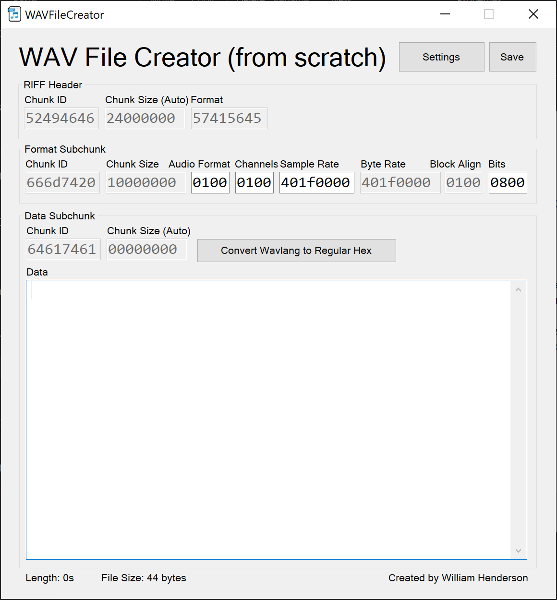

# WAVFileCreator
WAVFileCreator is a very basic tool to assist in the creation of WAV files from scratch. It's the first program I've written in C# (excluding those as part of a Unity project), and it's great for getting to grips with how WAV files are formatted.

## How do I use it?
All the sections you see in the GUI are joined together in order to make up the final WAV file. Every value is in hexadecimal, but some are big endian and some are little endian due to the nature of WAV files. The large data area at the bottom is where the actual audio data goes, and the smaller sections at the top are for the header data. 

I learned how WAV files work from [this excellent website](http://soundfile.sapp.org/doc/WaveFormat/), and I've written up what I've learned in [a couple of Markdown files](docs/index.md) in the `docs/` folder - have a read if you want to learn.

## Why is so much greyed out?
The areas that are greyed out are those which are either constant or are dependent on the editable areas. For example, the "Format" parameter in the RIFF header always contains the text "WAVE" in ASCII, so you can't change it. As another example, the chunk size parameter of the data subchunk just contains the length in bytes of the large data section, so allowing that to be changed would be pointless. You'll see as you change some values that lots of the greyed out values will change - this is because the program is automatically calculating the appropriate valid values.

If you want to edit them anyway, you can change the settings to allow it, but this is likely to produce a corrupted file.

## What's the point when I could just use Audacity or another audio editor?
If you're just looking to create a WAV file, *please, please don't use this*! This isn't an audio editor. This tool is intended for learning about the WAV format and messing around with WAV files at the most basic level. If that sounds like fun, feel free to head over to the [Releases page](https://github.com/w-henderson/WAVFileCreator/releases) and grab the latest version. It's likely to be buggy as my knowledge of C# is still very limited, so please open an issue with any bugs you find!

# Screenshot
